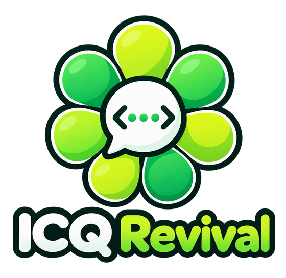

  

<h3 align="center">О-о! 🌼 Твоя стара ICQ знову онлайн.</h3>

  Улюблений месенджер двотисячних - той самий клієнт, ті самі звуки, та сама
  квітка - знову на зв'язку, сьогодні.

  <a href="README.md">English</a> · <b>Українською</b>

  
  
  
  

---

## Пам'ятаєш?

Зелена квітка в куті екрана. Номер, який знав напам'ять. «О-о!» нового
повідомлення, статус друга, що змінюється з *Відійшов* на *Готовий до
розмови*, файл, що йде зі швидкістю модема.

ICQ замовкла у 2024 році. **ICQ Revival повертає її** - не схожу копію, а саме
ті програми, якими ти тоді користувався. Встанови свою стару ICQ, увійди - і
список контактів оживе.

## Три кроки до старту

1. **Отримай номер.** Обери вільний номер ICQ Revival і пароль на сторінці
   реєстрації сайту ICQ Revival. Це хвилина.
2. **Підготуй клієнт.** Завантаж невеликий патч для своєї ICQ або плагін для
   Miranda на сторінці сайту *Клієнти та патчі* - посилання на неї є просто на
   сторінці реєстрації. Один раз введи адресу сервера - решту патч зробить сам.
3. **Увійди** зі своїм номером і привітайся. 👋

Перед будь-якими змінами оригінальний клієнт зберігається в резервну копію, а
одна кнопка повертає його точно таким, яким він був.

## Працює з класикою

| | Клієнт | Що працює |
|:-:|---|---|
| 🌼 | **ICQ Pro 2003b** | Усе, навіть отримання нового номера прямо з клієнта |
| 🌼 | **ICQ 6.5** | Повідомлення, анімовані аватари, tZers, голосові та відеодзвінки |
| 💬 | **QIP 2005 / QIP 2012** | Листування, профілі та пошук |
| 🧩 | **Miranda NG** | Плагін ICQ повернуто, і він оновлюється сам |
| 🏃 | **AIM 5-7, Pidgin** та інші клієнти OSCAR | Листування - просто впиши сервер у налаштуваннях |

Найкраще: **усі вони спілкуються між собою.** Друг з ICQ 2003b пише тобі в
ICQ 6.5 чи Miranda - як колись.

## Що повернулося

- 💬 **Повідомлення** - онлайн і офлайн, зі знайомими звуками.
- 👤 **Твій профіль** - ім'я, місто, день народження, «про себе» і пошук, щоб
  знайти старих друзів.
- 🖼️ **Фото та анімовані аватари** - завантаж світлину або обери одного з
  анімованих персонажів ICQ 6, що реагують на твої смайлики.
- 😜 **tZers** - маленькі анімовані жарти ICQ 6.5 знову грають.
- 📞 **Голосові та відеодзвінки** між користувачами ICQ 6.5.
- 📁 **Передача файлів** між друзями.
- 🎲 **Випадковий чат** - познайомся з кимось зі спільними інтересами.
- ✉️ **Вхід за e-mail** і відновлення пароля, якщо забув.
- 🧹 **Чисте вікно** - мертву рекламу, банери та зламані кнопки прибрано.

## Питання

**Це справжня ICQ?**
Ні. ICQ Revival - незалежний некомерційний проєкт, який роблять фанати. Він
повертає до життя старі програми на власному сервері.

**Чи збережеться мій старий номер ICQ?**
Номери оригінальної ICQ перенести неможливо. Ти обираєш новий - і часто можеш
взяти свій старий номер, якщо він вільний.

**Це платно?**
Ні. Ні реклами, ні оплати.

**Чи безпечно патчити старий клієнт?**
Так. Патч перевіряє кожен файл перед зміною, зберігає резервну копію, а
«Restore original» повертає клієнт точно таким, яким він був.

**Де взяти сам старий клієнт?**
Патчі працюють з ICQ Pro 2003b (збірка 3916) та ICQ 6.5 (збірка 2024). Самі
клієнти проєкт не роздає.

## Для допитливих і технічних

Як усе влаштовано, що потрібно кожному клієнту, як підняти власний сервер і
розробляти його - у **[вікі ICQ Revival](docs/wiki/Home.md)** (англійською).

---

ICQ Revival - незалежний некомерційний проєкт. Він не пов'язаний з ICQ,
AOL, Yahoo!, Mail.ru чи VK і не схвалений ними. ICQ та AIM - торговельні марки
їхніх власників. Побудовано на
[Open OSCAR Server](https://github.com/mk6i/open-oscar-server) від mk6i;
поширюється за [ліцензією MIT](LICENSE).
